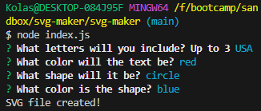

# SVG-Maker

An SVG Making utility for the Bootcamp.

## Installation

Download the application onto your machine, then run "npm i" in your terminal of choice to download the necessary dependencies.

## Usage

In your terminal, run "node index.js" to begin the Inquirer process to collect data. You will be asked to provide up to three letters, a shape, and a color fill for both the shape and the letters.

After providing this input, a new .svg file will be saved in the examples folder.

## Credits

N/A

## License

Please refer to the LICENSE in the repo.
